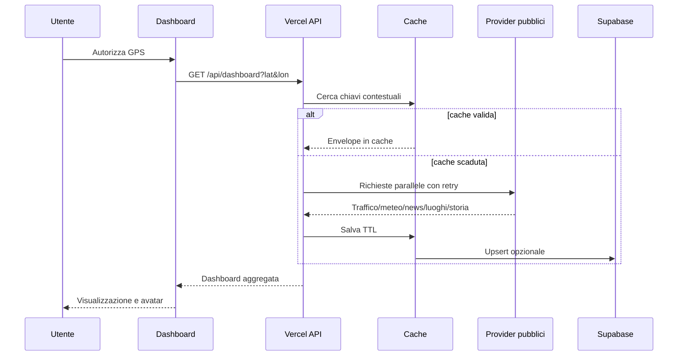

# Architettura

## Componenti

- Frontend statico: public/index.html, bundle TypeScript e CSS Tailwind.
- API: funzioni stateless in api/, condividono validazione, auth, cache, retry e logging.
- Persistenza: Supabase Postgres con service role solo lato server e RLS per accesso utente.
- AI: /api/chat/completions costruisce un system context aggiornato prima di chiamare OpenAI.
- Avatar: iframe LiveAvatar già configurato; API opzionale per nuovi embed e contesti.
- Scheduling: Vercel Cron richiama il refresh; Supabase pg_cron gestisce manutenzione e può invocare l Edge Function.

## Contratto dati

Ogni provider restituisce un envelope con data, source, quality, fetchedAt, expiresAt e warning opzionale. quality distingue live, cached, estimated e unavailable.

## Resilienza

- Timeout upstream di 8 secondi.
- Tre tentativi con backoff esponenziale e jitter per 429 e 5xx.
- Cache memoria per bassa latenza e Supabase per condivisione tra istanze.
- Vercel stale-while-revalidate sulle risposte pubbliche.
- Provider traffic fallback deterministico e dichiarato quando TomTom non è configurato.
